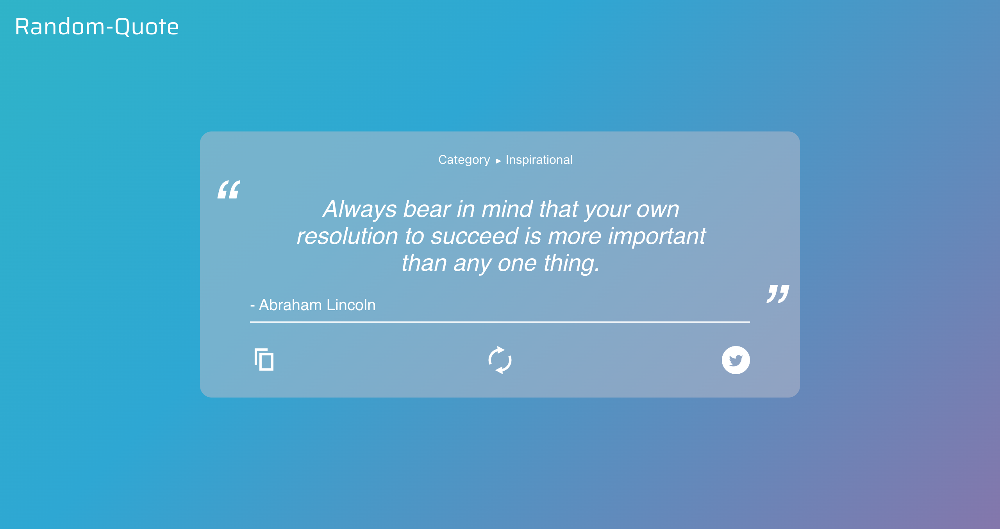
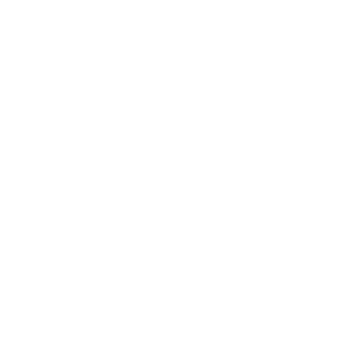

 best viewed in dark mode 

#  Random-Quote 

a random quote generator website

  
## 🛠️ Features

|  |  |   | 
Category  <i>&#x25B6;</i> 
 |
| ------------- | ------------- | ------------- | ------------- |
| generate new quote  | copy displayed quote to clipboard  | tweet displayed quote  | change quote category |

## 📖 Background

I made the site to introduce myself to the basics of the React framework. As such, i started by following a [tutorial](https://www.youtube.com/watch?v=oZb_nGEKZTQ&t=1228s)
but have expanded upon it with the following:
- the category feature
- a different [api](https://github.com/lukePeavey/quotable) (which generates a single quote every time as opposed to the 50 generated ones on the old one)
- a redesign of the interface (as to accomodate the new category feature)
- a dynamic background

