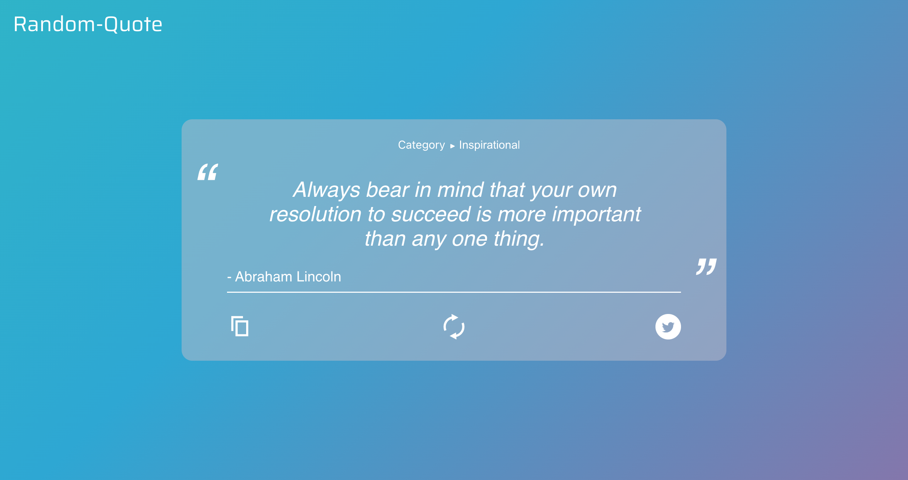

# Random-Quote 

un site web générateur de citations anglaises aléatoires

  
## Fonctions

|  |  |   | 
Category  <i>&#x25B6;</i> 
 |
| ------------- | ------------- | ------------- | ------------- |
| générer une nouvelle citation  | copier la citation affichée dans le presse-papiers  | tweeter la citation affichée  | changer de catégorie de citations |

## Contexte

J'ai crèe ce site pour apprendre les bases du framework React. J'ai donc commencé par suivre un [tutoriel](https://www.youtube.com/watch?v=oZb_nGEKZTQ&t=1228s)
mais je l'ai developpé avec les éléments suivants :
- la fonction de catégorie
- une [api](https://github.com/lukePeavey/quotable) différente (qui génère une seule citation à chaque fois au lieu des 50 générées sur l'ancienne)
- une refonte de l'interface (pour accueillir de la nouvelle fonction de catégorie)
- un arrière-plan dynamique 

